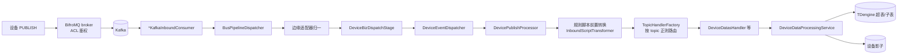
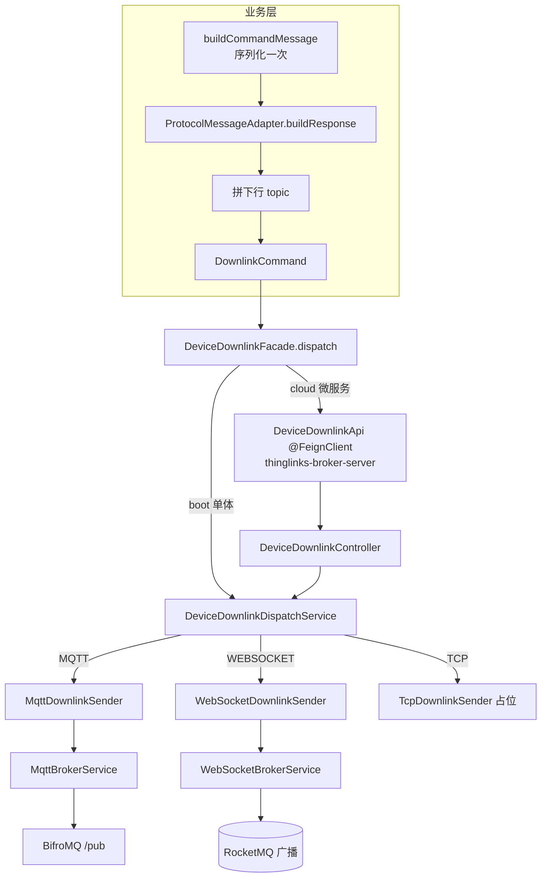
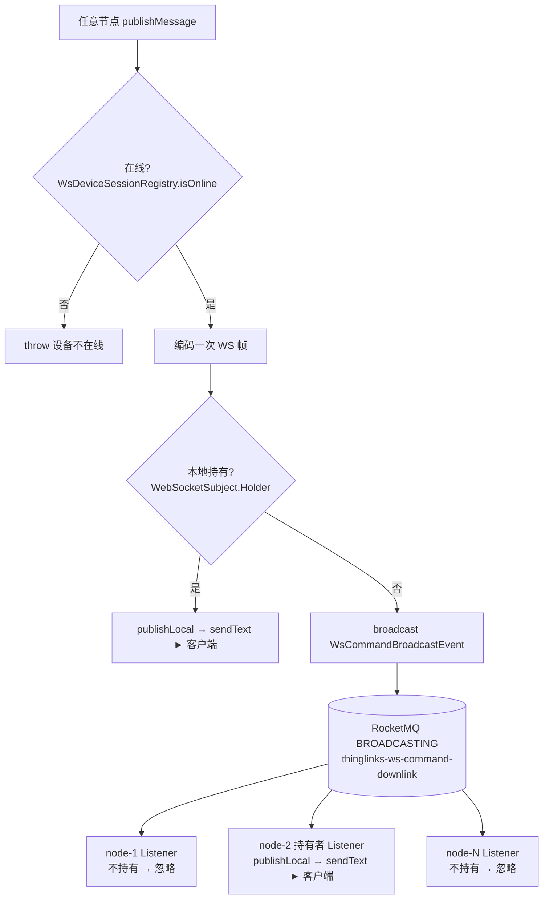

# 架构图(Mermaid)

GitHub 可直接渲染。文字版细节见对应 reference;此处只给"一眼看全貌"的图。

## 上行链路(设备 → 影子/时序)

> 细节:`references/iot/uplink-pipeline.md`、`references/iot/rule-script.md`、`references/iot/device-data.md`

## 下行链路(业务构造 → DeviceDownlinkFacade → broker)

> 细节:`references/iot/downlink-command.md`

## WS 下行广播(任意节点 → 持有节点 → 客户端)

> 细节:`references/iot/ws-downlink-broadcast.md`

